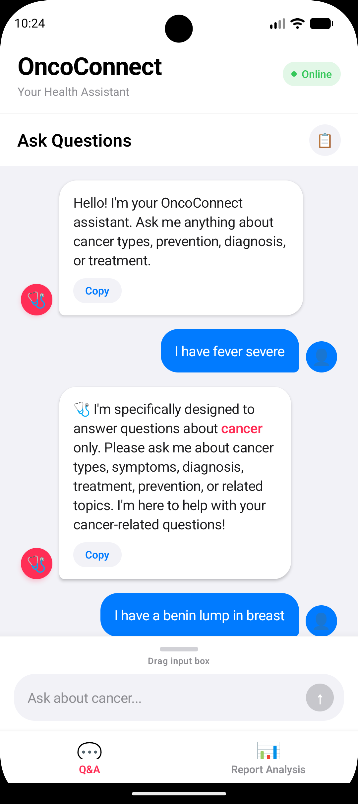

# Cancer Q&A Chatbot - Mobile App

Android-first mobile client for the Cancer Q&A Chatbot, built with React Native and Expo.

## App Screenshot



If your screenshot is stored in a different location, update the path above.

## Tech Stack (Mobile)

| Layer | Stack | Purpose |
| --- | --- | --- |
| Mobile Framework | React Native (0.76.9) | Cross-platform native UI |
| Runtime | React (18.3.1) | Component/state model |
| App Platform | Expo SDK 52 | Dev server, native runtime, build tooling |
| Navigation | React Navigation (Native + Bottom Tabs) | Q&A and Report Analysis tabs |
| Networking | Axios | API calls to Flask backend |
| File and Media | Expo Image Picker, Document Picker, File System | Capture/select reports and process files |
| Device UI Support | react-native-safe-area-context, react-native-screens | Safe area layout and screen optimization |
| Build and Native Config | expo-build-properties, Android Gradle project | Native Android build settings |
| Android Build/Distribution | EAS Build | Preview and release Android builds |

## Dependencies Table

### Production Dependencies

| Package | Version | Why it is used |
| --- | --- | --- |
| @expo/metro-runtime | ~4.0.1 | Metro runtime support for Expo apps |
| @react-navigation/bottom-tabs | ^6.5.11 | Bottom tab navigation UI |
| @react-navigation/native | ^6.1.9 | Navigation container and core APIs |
| axios | ^1.6.5 | HTTP client for backend communication |
| expo | ~52.0.49 | Expo SDK base package |
| expo-asset | ~11.0.0 | Asset management for app resources |
| expo-build-properties | ~0.13.3 | Override native build properties |
| expo-constants | ~17.0.0 | Access app/system constants |
| expo-document-picker | ~13.0.0 | Pick report files from device |
| expo-file-system | ~18.0.0 | Read and process report files |
| expo-font | ~13.0.0 | Font loading support |
| expo-image-picker | ~16.0.0 | Capture/select medical report images |
| expo-status-bar | ~2.0.0 | Status bar styling |
| react | 18.3.1 | React runtime |
| react-native | 0.76.9 | Native rendering layer |
| react-native-safe-area-context | 4.12.0 | Handle notches/safe areas |
| react-native-screens | ~4.4.0 | Native screen primitives/performance |
| react-native-web | ~0.19.13 | Optional web target support |

### Development Dependencies

| Package | Version | Why it is used |
| --- | --- | --- |
| @babel/core | ^7.25.2 | JS transpilation pipeline |
| sharp | ^0.34.5 | Image processing for icon/assets workflows |

## Interactive Widgets and User Flows

| Widget/Component | Screen | Interaction |
| --- | --- | --- |
| Bottom Tab Navigator | Main App | Switch between Q&A and Report Analysis |
| Connection Status Pill | Header | Shows backend Online/Offline state |
| Chat Input Composer | Q&A | Type and send questions |
| Message Stream | Q&A | Scroll through user/bot conversations |
| Chat History Modal | Q&A | Open previous conversations and re-load responses |
| Copy-to-Clipboard Action | Q&A | Copy generated answer text |
| Context-Aware Safety Responses | Q&A | Guided follow-up when symptom input is incomplete |
| Image Picker | Report Analysis | Select report image from gallery |
| Camera Capture | Report Analysis | Capture report photo directly |
| Manual Text Input | Report Analysis | Paste/type report text for analysis |
| AI Analysis Progress State | Report Analysis | Step-by-step processing feedback |
| Report Q&A Follow-up | Report Analysis | Ask additional questions based on extracted report text |

## Project Setup (Mobile)

### 1) Prerequisites

- Node.js 18+
- npm
- Android Studio (for emulator) or Expo Go on Android device
- Flask backend project available and runnable

### 2) Install

```bash
cd mobile
npm install
```

### 3) Start (Recommended: auto backend + mobile)

```bash
npm start
```

This runs `start-with-backend.js`, which starts backend + Expo together.

### 4) Start (Manual split terminals)

Terminal 1 (backend):

```bash
cd Cancer_chatbot
python app.py
```

Terminal 2 (mobile only):

```bash
cd mobile
npm run start-mobile-only
```

### 5) Run on Android Emulator

1. Launch an Android emulator from Android Studio.
2. Run:

```bash
npm start
```

3. Press `a` in Expo terminal.

### 6) Run on Physical Android Device

1. Install Expo Go.
2. Keep phone and computer on same network.
3. Update `extra.apiUrl` in `app.json` from emulator URL to your machine LAN IP, for example:

```json
"apiUrl": "http://192.168.1.100:5000"
```

4. Start backend and Expo.
5. Scan QR code in Expo Go.

## NPM Scripts

| Script | Command | Purpose |
| --- | --- | --- |
| start | `node start-with-backend.js` | Start backend + Expo together |
| start-mobile-only | `expo start` | Start only the mobile client |
| android | `expo run:android` | Build/run Android natively |
| ios | `expo run:ios` | Build/run iOS natively |
| web | `expo start --web` | Run web target |
| eas:build:android | `eas build --platform android` | Android cloud build |
| eas:build:android:preview | `eas build --platform android --profile preview` | Preview profile cloud build |

## Android Build (EAS)

```bash
npm install -g eas-cli
eas build:configure
eas build --platform android --profile preview
```

## Important Configuration

| Environment | Backend URL |
| --- | --- |
| Android emulator | `http://10.0.2.2:5000` |
| Physical device | `http://<your-local-ip>:5000` |

Configure this in `app.json` under `extra.apiUrl`.

## Project Structure

```text
mobile/
|-- App.js
|-- QAScreen.js
|-- ReportAnalysisScreen.js
|-- HistoryModal.js
|-- api.js
|-- reportAI.js
|-- formatRichText.js
|-- app.json
|-- package.json
|-- start-with-backend.js
|-- android/
`-- assets/
```

## Troubleshooting

| Problem | Checks |
| --- | --- |
| Cannot connect to backend | Verify backend on port 5000, CORS enabled, correct `apiUrl`, same network |
| Expo app issues | Run `expo start -c`, reinstall dependencies |
| Device cannot access backend | Confirm firewall/network rules and LAN IP correctness |

## License

Part of the Cancer Q&A Chatbot project. Refer to the root project license.
